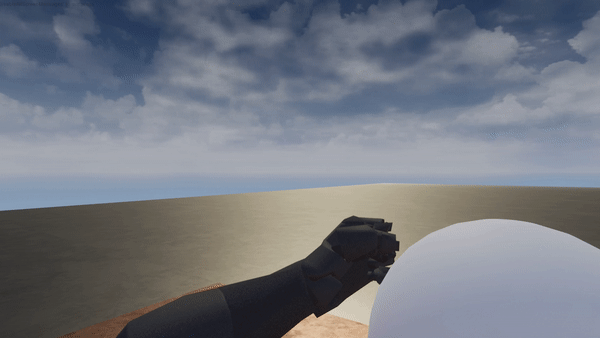

**By ABM_Blueberry(73ddy)** 
 
*28.10.2022*  
Пофиксил баг с ходьбой, почти доделал стрельбу.

*29.10.2022*  
Доделал стрельбу. 
`BP_Bullet` отвечает за внешний вид снярада и его аэродинамические качества.

*2.11.2022*  
Сделал спринт x2,5 от обычного бега. 
Сделал специальную способность `SuperFast Ability`(сокр. `SFAbility`), 
она увеличивает скорость передвижения x5 во все стороны (спринт работает только при движении вперед), 
убирает скольжение и увеличивает разгон. Также меняется FOV игрока с 90 до 110.  
  
*Изменение FOV*

Планирую сделать кулдаун для этой способности и эффект HUD'а

  
*Референс эффекта для HUD*

*3.11.2022*  
Поменял механику изменения FOV игрока. Раньше эта механика выполнялась через `Event tick` - теперь подключены два специальных таймеры для этого.  
Это сделано с целью оптимизации процесса.

*5.11-15.11.2022*
**Баги:**
Пофиксил баг со спринтом
**HUD:**
Добавил отображение здоровья
Добавил прогрессбар выносливости, который появляется только во время спринта
**Подбор оружия, патронов и аптечек:**
Реализовал подбор оружий и патронов через клавишу `E`. При наведении на объект выводится надпись, уведомляющая о том, что этот объект можно поднять.
Аптечки подбираются автоматически, если игрок прошел сквозь них.
